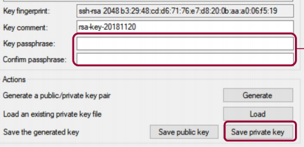

# Explanation of GitHub SSH

------

#### 1. SSH 란

<!--SSH 란 무엇인가에 대한 설명-->

<!--SSH uses public-key cryptography to authenticate the remote computer and allow it to authenticate the user, if necessary.-->

**SSH**는 공개 키 암호화를 사용하여 원격 시스템을 인증하고 필요한 경우 사용자를 인증할 수 있도록 한다. 

------

#### 2. SSH 사용 방법

<!--SSH 사용방법에 대한 설명-->

<!-- One is to use automatically generated public-private key pairs to simply encrypt a network connection, and then use password authentication to log on.-->

<!--Another is to use a manually generated public-private key pair to perform the authentication, allowing users or programs to log in without having to specify a password.-->

하나는 자동으로 생성된 공개-개인키 쌍을 사용하여 네트워크 연결을 암호화한 다음 로그인 할 때 암호 인증을 사용한다.

또 다른 방법은 수동으로 생성한 민관 키 쌍을 사용하여 인증을 수행 함으로써 사용자나 프로그램이 암호를 지정하지 않고도 로그인 할 수 있도록 하는 것이다.

------

#### 3. 공개(Public) 키(key) 암호 체계(Cyptosystem)

<!--A public-private key pair  -->

공개 - 개인(Private) 키 쌍

------

#### 4. 디지털 서명 개념

<!--A concept of Digital Signature-->

------

#### 5. SSH Key 생성 또는 불러오기

#### 5. END
